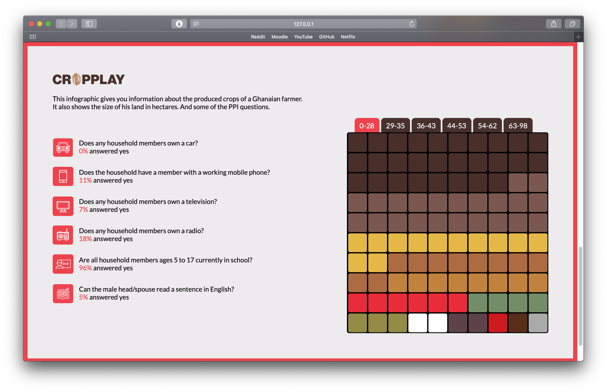

# Cropplay (UTZ - Rainforest Alliance) 



## Introduction 
The assignment was to create a datavisualisation that showed the economic and social factors in a Ghanese farmer's life. The data was gathered bij KIT and UTZ. 

## Code used
I used code made by J. Kunst (http://jkunst.com/). Which generated a reusable waffle chart. By installing d3.js and filling in the following code to your liking.

```js
d3.csv("./databron/ppi_0_28.csv", function(err, data) {
	if (err) {
	  console.error(err);
	} else {
	  var waffle = new WaffleChart()
		.selector("#waffle")
		.data(data)
		.useWidth(false)
		.label("Cultivated crops in percentages")
		.size(45)
		.gap(3)
		.rows(10)
		.columns(10)
		.rounded(false)();
	}
  });
```

The code itself is found in js/waffle.js. Some of this code is rewritten to better suit our needs. For instance: 

```js 
var color = d3.scale.linear()
        .domain([1, _obj.data.length - 1])
        .domain ([1, 2, 3, 4, 5, 6, 7, 8, 9, 10, 11, 12])
        .interpolate(d3.interpolateRgb)
        .range(["#EC2833", "#718E66", "#D11515", "#5E4249", "#E6B83A", "#AE6B3E", "#C28336"]);
```

Took the index of our entries to fill the rectangle with a corresponding color. 
It's been rewritten to check for the string of 'crop' which color must be used.

```js
var cacao = "#492F2A"
      var cassave = "#7B574F"
      var maize = "#E6B83A"

item.enter()
        .append("rect")
        .attr("class", "unit")
        .attr("width", _obj.size)
        .attr("height", _obj.size)
        .attr("fill", function(d) {
          console.log(d)
        if (d.crop=="cacoa") {
            return cacao;
        }
        else if(d.crop=="cassava") {
          return cassave;
        } 
        else if(d.crop=="maize") {
          return maize;
        }    
```

## Data Structure 
The data must be structured in the exact way, it can't have decimals and must always be a total of 100

```csv
crop,value
cacoa, 19
cassava, 16
plantain, 15
cocoyam, 9
maize, 9
pepper, 6
yam, 5
oranges, 5
tomatoes, 4
okra, 3
eggplant, 2
palm, 2
rice, 2
chili, 1
other, 2

```

## To-Do

- [ ] Dynamic Data
- [ ] Dynamic ppi-questions
- [ ] Responsive
- [ ] Cleaner HTML 
- [ ] Give user more options & clarity (tooltip, legend)